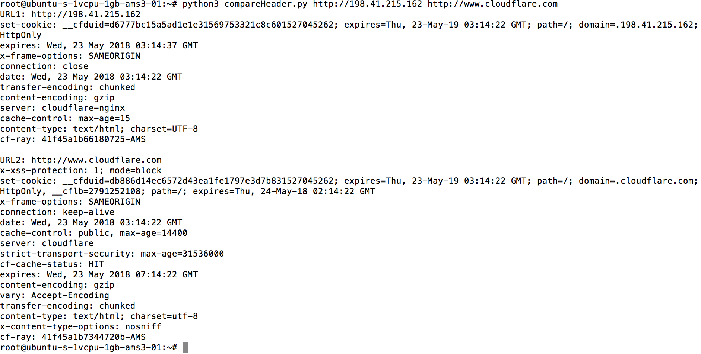

# SampleWebsite

Code for sample website

## Table of Contents
* [Requirements](#requirements)
* [Installation](#installation)
* [Usage](#usage)

## Requirements
* Ubuntu (v14.04 LTS)
* Python (v3)
* Requests (python) module
* nginx

## Installation
```
git clone https://github.com/feliciahsieh/SampleWebsite.git
```

## Usage
For the python3 script, compareHeader.py, type
```
python3 compareHeader.py http://198.41.215.162 http://www.cloudflare.com
```

to compare the HTTP header options.

<p align="center"></p>
